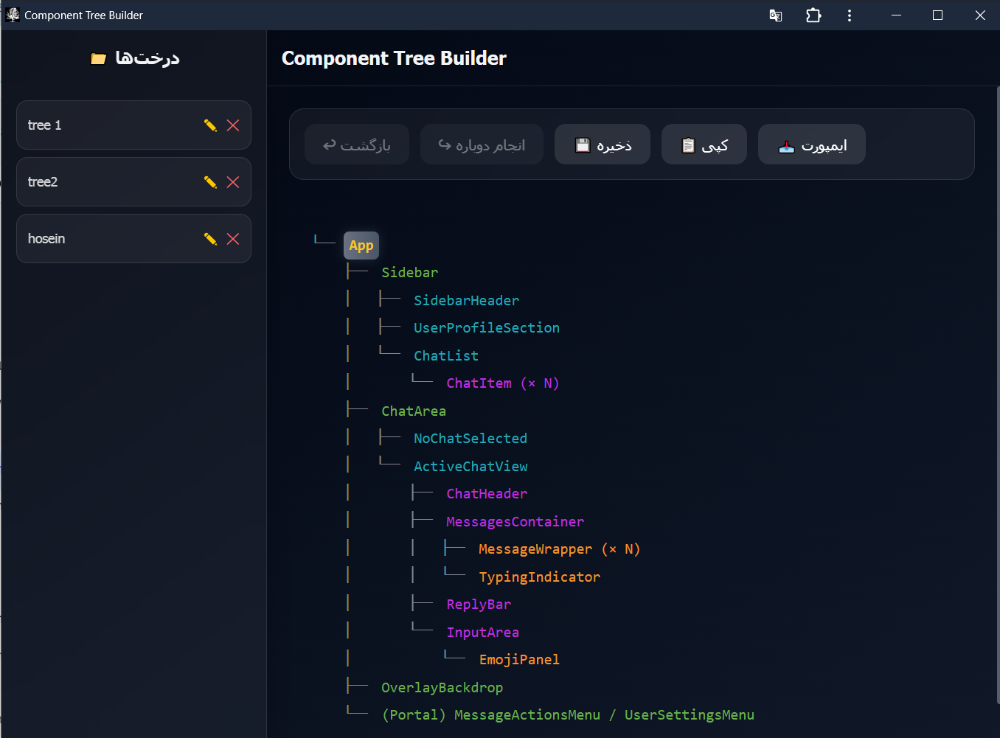

# 🌳 Component Tree Builder (Glass Edition)

An interactive, glassmorphism-styled hierarchical tree editor built for the web.  
Create, edit, delete, save, load, and import component trees with a beautiful dark UI — now fully installable as a PWA for offline use.

---

## 🚀 Demo

--- 

## ✨ Features

- **Hierarchical tree display** with classic `├──` / `└──` lines and depth‑based colors.
- **Right‑click context menu** on any node — add child, sibling, edit, or delete.
- **Undo/Redo** (up to 50 steps) with `Ctrl+Z` / `Ctrl+Y`.
- **Save trees to localStorage** and manage them via a slide‑out sidebar.
- **Import/Export** trees as formatted text (parse tree text into nodes).
- **Copy to clipboard** the tree structure.
- **Responsive design** — mobile sidebar toggle, touch‑friendly.
- **Glassmorphism UI** — dark backgrounds, blur, transparency, and elegant depth.
- **PWA support** — install on desktop/mobile and run completely offline, no server needed after first install.

---

## 🛠 Tech Stack

| Category         | Technology                       |
| ---------------- | -------------------------------- |
| Framework        | Next.js 16 (App Router)          |
| Language         | TypeScript (strict mode)         |
| Styling          | Tailwind CSS v4 + glass effects  |
| State Management | Zustand (multiple domain stores) |
| Icons            | Lucide React                     |
| PWA              | Custom Service Worker, Manifest  |
| Package Manager  | pnpm / npm / yarn                |

---

## 📦 Getting Started

### Prerequisites

- Node.js 18+
- npm, pnpm, or yarn

### Installation

```bash
git clone <your-repo-url>
cd component-tree-app
npm install
Run in Development
bash
npm run dev
Open http://localhost:3000 in your browser.

📱 PWA – Install & Offline Usage
This app is a Progressive Web App. Once installed, it works without any server and keeps all styles/scripts even when offline.

1. Build for production
bash
npm run build
This generates static files in the out/ folder and automatically creates a service worker with all assets precached.

2. Serve the static build (one‑time)
bash
npx serve out
Open the shown local URL (e.g., http://localhost:3000) in your browser.

3. Install the PWA
Look for the Install icon in the browser address bar (or use the browser menu → "Install app").

Follow the prompt to add the app to your desktop / home screen.

4. Use offline
After installation, you can stop the local server (Ctrl+C).

Launch the app from its icon. It will run entirely from cache, with full UI and functionality.

📖 How to Use
Tree Operations
Add root child: Right‑click on the root node (or use the first available node) → Add Child.

Add sibling / child: Right‑click any node → Add Sibling or Add Child.

Edit node name: Right‑click → Edit.

Delete node: Right‑click → Delete (confirmation modal appears).

Keyboard Shortcuts
Ctrl + Z – Undo

Ctrl + Y – Redo

Save & Load
Save: Click the Save button in the top toolbar → enter a name → tree appears in the sidebar.

Load: Click any saved tree in the sidebar. The current tree is replaced.

Rename / Delete: Use the edit/delete icons next to each saved tree.

Import / Export
Import: Click Import in the toolbar → paste a tree in text format (indented or with ├── lines) → parse and load.

Copy: Click Copy to write the tree structure to your clipboard.

Sidebar
On desktop: always visible on the left.

On mobile: tap the hamburger menu (☰) to open; tap the close button or outside to close.
```
